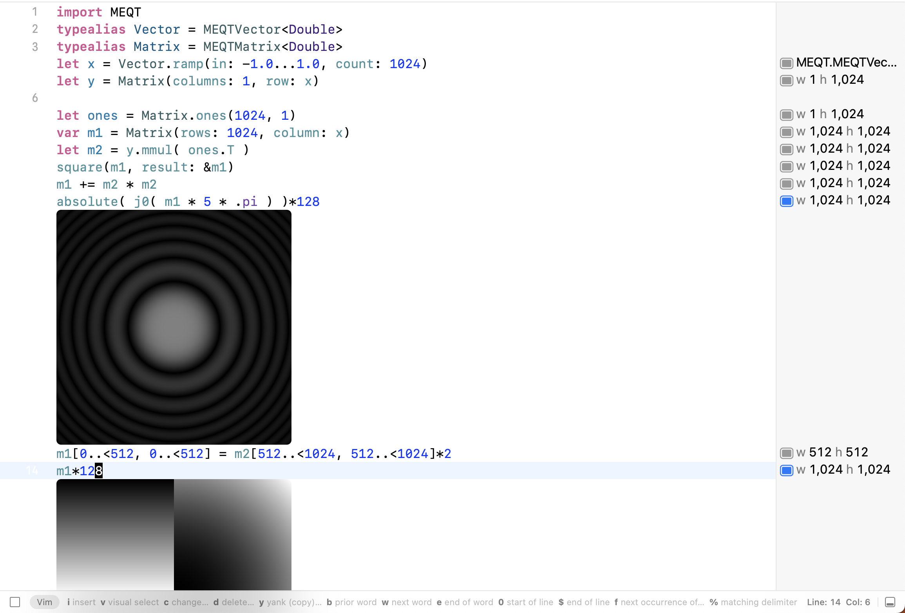

# MEQT
Swift wrapper for numerical operation. Aims to provide Protocols with Accelerate Implement on Apple platforms and use OpenBLAS ... Implement on Linux and Windows.


Snapshot running in Xcode playground. Visualization implemented by comformation to `CustomPlaygroundDisplayConvertible` Protocol.


## Objective
- Cover data types of UInt, Int, Floating Point, to Complex, SIMD, and Quaternions.
- Basic Matrix Operation, Linear Algebra, DSP ...
- Comparable efficient to common Numerical Programming tools with clear syntax (not short).


## Example
A glimpse of syntax
``` swift
import MEQT
typealias Vector = MEQTVector<Double>
typealias Matrix = MEQTMatrix<Double>
let x: Vector = Vector.ramp(in: -1.0...1.0, count: 1024)
let y = Matrix(columns: 1, row: x)

let ones: Matrix = Matrix.ones(1024, 1)
var m1 = Matrix(rows: 1024, column: x)
let m2 = y.mmul( ones.T )
square(m1, result: &m1)
m1 += m2 * m2
// absolute( j0( m1 * 5 * .pi ) )*128
m1[0..<512, 0..<512] = m2[512..<1024, 512..<1024]*2
// m1*128
```

## Current State
- Protocols for Basic Operations
- macOS Basic Implementation for Double with Accelerate Framework
- No document yet 🤕.
